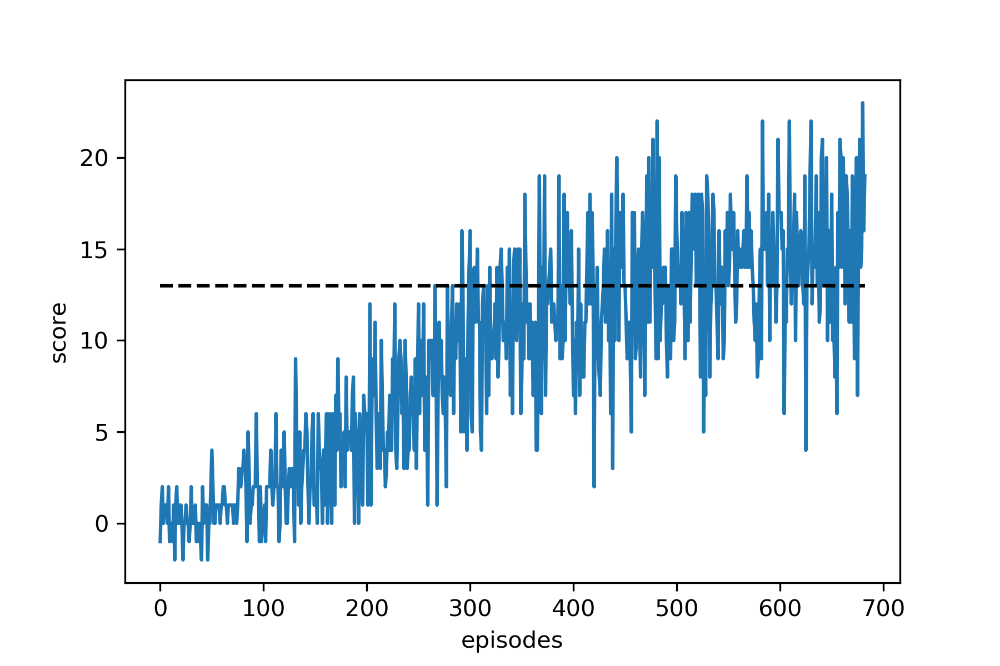

# Report

## About

In this report we describe in more details the implementation used here.

To summarize the goal of the gameconsists in picking up normal bananas in a 2d plane, avoiding blue bananas. We provide to the agent a 37 dimensional state (floating numbers), and the dimension of the action space is 4 (left, right, up and down). 

## Implementation

We used a [Duelling Q Network](https://arxiv.org/abs/1511.06581) (with two copies online and target) with a main body of 4 sequential Fully-connected layers (with 32, 64, 64 and 64 units). Then it gets splitted in two to provide the state value and the advantage value outputs with two more fully-connected layers each. For the state value the number of units is 128 and 1. For the advantage value the number units is 128 and 4 (action space size).

To decide actions we use the $\epsilon$-greedy algorithm with starting \epsilon = 1.0 and decaying rate of 0.995 per episode (with minimum $\epsilon_{min}=$0.01).

## Learning Algorithm

- For the learning algorithm we implemented [prioritized experience replay](https://arxiv.org/abs/1511.05952) to provide buffer replay to the agent using e = $10^{-3}$ , $\alpha = 0.25$, and $\beta = 1$. We also used a discount factor $\gamma = 0.99$ and a soft update parameter $\tau = 10^{-3}$.

- Network training utilizes Adam optimizer with learning rate $5\times 10^{-4}$. 

- Finally to help training faster, we impose first episodes to be shorter, with a maximum time of 400, that might be increased every 400 episodes.

## Plot of Rewards

The algorithm trains really well and in less than 600 episodes it surpass the target of score 13. It reaches 15 in 583 episodes finishing the training. In the figure below the score averaged over a window of 100 episodes is shown as a function of the number episodes (blue line). In black dashed line we show the target of 13. 

## Future improvements

- This could be improved by implementing an Actor-Critic algorithm that might improve stability and producing the algorithm to converge faster

- Also, we could improve the architecture of the Duelling Neural Network that we have not explored much.

- 
